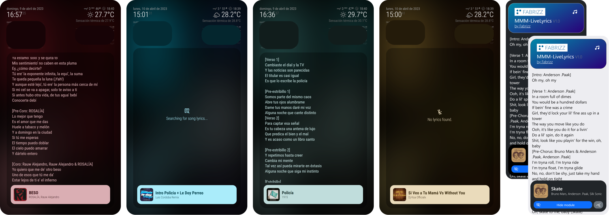

[](https://fabriz.co/)

#

### 

### 

# How does it work?
This module shows the lyrics of the song that you are currently listening to. Uses the [**`MMM-OnSpotify`**](https://github.com/Fabrizz/MMM-OnSpotify) module to get the requiered data from Spotify and to sync color data (to give the module a refreshing look!). You can customize almost everything in the module, so you can use it on lower end devices or give it custom functionality.

It also includes a **Remote Control and API**. You can read more [about the Remote Control here](#remote-control), and more [about the API here](#api)

> The module uses the [Genius API](https://docs.genius.com/) directly and the [Spotify API](https://developer.spotify.com/) through [MMM-OnSpotify](https://github.com/Fabrizz/MMM-OnSpotify).

# Installation
### _Step 1: Install the module_
```bash
cd ~/MagicMirror/modules
git clone https://github.com/Fabrizz/MMM-LiveLyrics.git
cd MMM-LiveLyrics
npm install
```

### _Step 2: Get a Genius API Token_

  - Log in to the [Genius API Dashboard](http://genius.com/api-clients)
  - Click on **"NEW API CLIENT"**, then, give you app a name, something that you could remember later, like "`MagicMirror`" or "`LiveLyrics`". You also need to set the app url, as its not actually a service, you can put whatever you want, for example "`https://livelyrics.com/`" or "`https://test.com/`".
  - Click on **"Generate Access Token"**, copy the token, as you are going to need it in the next step, in the `accessToken` field.

### _Step 3: Set the module in your **`config.js`** file_
```js
{
  // This is the base config. See more config options below
	module: "MMM-LiveLyrics",
	position: "fullscreen_below", // Do not change position
	config: {
		accessToken: "YOUR ACCESS TOKEN", // Paste here your token
	}
},
```

##
With <3 by Fabrizz | Give it a star if you like it! <br />[fabriz.co](https://fabriz.co/) (also work in progress) [](https://fabriz.co/)