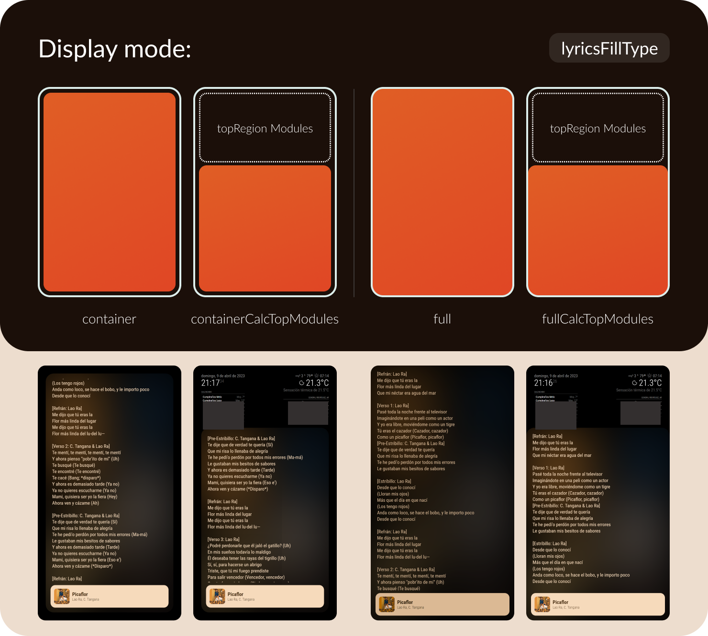
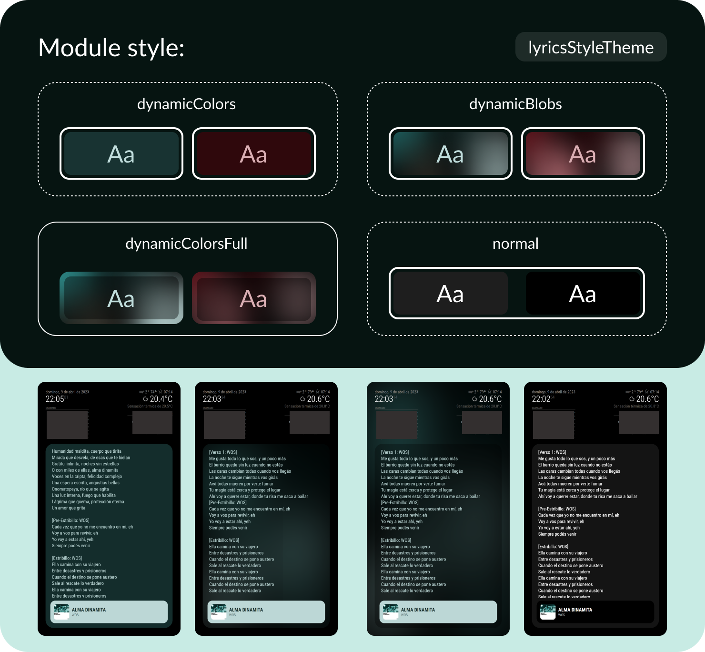
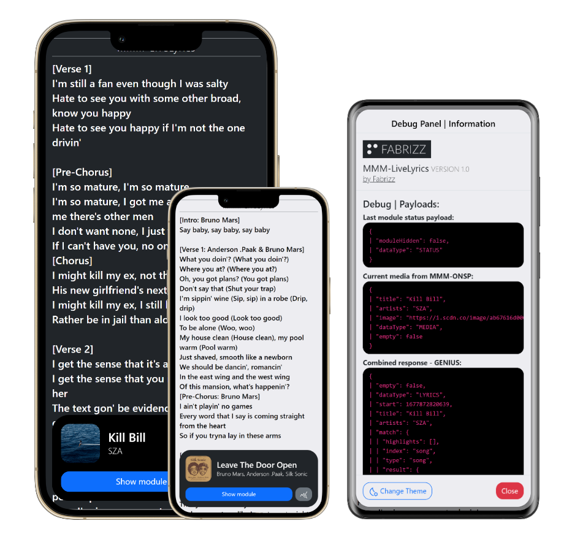
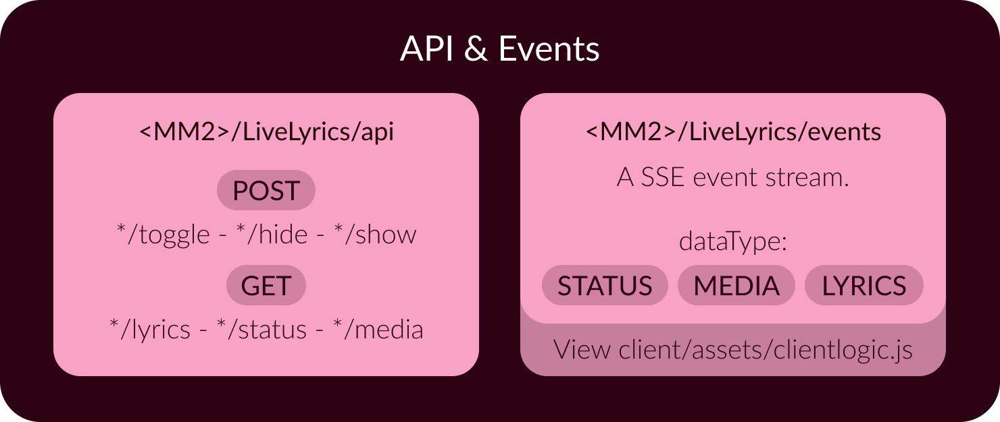

[](https://fabriz.co/)

#

### 

### 

# How does it work?
This module shows the lyrics of the song that you are currently listening to. Uses the [**`MMM-OnSpotify`**](https://github.com/Fabrizz/MMM-OnSpotify) module to get the requiered data from Spotify and to sync color data (to give the module a refreshing look!). You can customize almost everything in the module, so you can use it on lower end devices or give it custom functionality.

It also includes a **Remote Control and API**. You can read more [about the Remote Control here](#remote--api), and more [about the API here](#remote--api)

> The module uses the [Genius API](https://docs.genius.com/) directly and the [Spotify API](https://developer.spotify.com/) through [MMM-OnSpotify](https://github.com/Fabrizz/MMM-OnSpotify).

# Installation
### _Step 1: Install the module_
```bash
cd ~/MagicMirror/modules
git clone https://github.com/Fabrizz/MMM-LiveLyrics.git
cd MMM-LiveLyrics
npm install
```

### _Step 2: Get a Genius API Token_

  - Log in to the [Genius API Dashboard](http://genius.com/api-clients).
  - Click on **"NEW API CLIENT"**, then, give you app a name, something that you could remember later, like "`MagicMirror`" or "`LiveLyrics`". You also need to set the app url, as its not actually a service, you can put whatever you want, for example "`https://livelyrics.com/`" or "`https://test.com/`".
  - Click on **"Generate Access Token"**, copy the token, as you are going to need it in the next step, in the `accessToken` field.

### _Step 3: Set the module in your **`config.js`** file_
```js
{
  // This is the base config. See more config options below
	module: "MMM-LiveLyrics",
	position: "fullscreen_below", // Do not change position
	config: {
		accessToken: "YOUR ACCESS TOKEN", // Paste here your token
	}
},
```

> **Note**
> Remember to update [**`MMM-OnSpotify`**](https://github.com/Fabrizz/MMM-OnSpotify) to the latest version, so the modules can get the necessary data from each other. | **Minumum supported version: _V2.2.0_**

# Module configuration
The module ships with defaults that priorize a vertical mirror and the use of Dynamic Theming, the next section ilustrates the basic style options of the module, on the advanced section you have every configuration option as well as a detailed explanation.
## Basic style options:
### 
### 
### 
## Advanced options:
The following code block contains the all the module options:
```js
{
	module: "MMM-LiveLyrics",
	position: "fullscreen_below", // Do not change position
	config: {
		accessToken: "YOUR ACCESS TOKEN", // Paste here your token

		// Module behaviour [See below]
		useDefaultSearchFormatter: true,
		useMultipleArtistInSearch: true,
		logSuspendResume: false,
		showConnectionQrOnLoad: false,
		connectionQrDuration: 12,
		sideBySideOnLandscape: false,
		startHidden: false,
    	hideSpotifyModule: true,
		updateTopModulesCalcOnData: true,

		// Lyrics style [See below]
		lyricsFillType: "containerCalcTopModules",
    	lyricsContainerBackdropStyle: "black",
    	lyricsStyleTheme: "dynamicblobsFull",
		lyricsFontName: null,
    	lyricsFontSize: null,
    	lyricsTextAlign: null,
		lyricsCustomFixedDimentions: false,

		// Scroll and others [See below]
		scrollStrategy: "bySections",
    	scrollUpdateEvery: 3,
    	hideStrategy: "flex",
    	blurToBlackOnFull: false,
		useAnimations: true,
	}
}
```
### Behaviour options:
| Key | Default | Description |
| :-- | :--: | :-- |
| useDefaultSearchFormatter | `true` | The module includes regex matching for certain pages, words or urls that do not return lyric data, if you want to only use custom regex, you can disable this option. (Module and custom can be used at the same time if enabled) [See more below.](#custom-regex) |
| useMultipleArtistInSearch | `true` | If you want to use multiple (2) artists when searching for the song lyrics. |
| logSuspendResume | `false` | If the module should log when the visibility changes. |
| showConnectionQrOnLoad | `true` | Shows a banner with a QR code to use the remote controller. It uses your server IP and MM2 configuration to generate the url. <br /><br /> |
| connectionQrDuration | `12` | The time the connection QR is shown before the module is loaded. |
| sideBySideOnLandscape | `false` | If you have a big landscape screen, you could want to show the lyrics/info horizontally instead of vertically. <br /><br />  |
| startHidden | `false` | If the module should start hidden. Soft hidden ≠ Module hidden, this refers to the second, if set to true, the module starts hidden to the MM2 system, being only shown if called via the api or the remote. (This option also depends on what `hideStrategy` you use.)|
| hideSpotifyModule | `true` | If MMM-OnSpotify should be hidden when this module is loaded, as we are working with low power devices and overlaying data over other modules, showing both is not necessary. |
| updateTopModulesCalcOnData | `true` | If the calculations for the top modules region clerance should be done everytime the player updates. This is usefull, for example, if you have a calendar that is updated often and the height is not fixed. |

### Lyrics style:

> **Warning**
> - If you are using a **RPI4** I recommend to keep the basic provided settings.
> - If you are using the running the server on oter machine or using a **higher power device**, you can turn on the `animations` setting, giving the module better color transitions on song changes.
> - If you are using a **RPI3** or below, its recommended to disable animations and use the scroll by sections, as its not repainting every tick. You can also use CSS to disable basic animations like the fade in or the breathe on song lookup.

| Key | Default | Description |
| :-- | :--: | :-- |
| lyricsFillType | `containerCalcTopModules` | [[Ilustration](#basic-style-options)] How the height is calculated and if its shown inside a container. Options: <br />- `container`: Uses all the space in the viewport, contains the lyrics in a container. (Uses MM2 gap calcs) <br />- `full`: Uses all the space in the viewport, does not contain the lyrics. <br />- `containerCalcTopModules`: Uses the full viewport but the height is determinated calculation the longest top region, also uses MM2 gap calcs to give it a balanced look. You can access the dynamic CSS variables to create custom styles. <br />- `fullCalcTopModules`: The same as `containerCal...`, but its shown as a card in the bottom region instead of a floating container. <br /> Every option styles (or removes) the backdrop differently.|
| lyricsContainerBackdropStyle | `black` | [[Ilustration](#basic-style-options)] If the fill type is a container and you are not using fullscreen dynamic theming, you can select the style of a backdrop between the modules and the lyrics container. Options: <br />- `CSS`: Use any css color value, (black, #0000004e, etc) <br />- `blurred`: Applies a CSS filter based on em size, not recommended on lower end devices, as blurring is a gpu intensive task. |
| lyricsStyleTheme | `dynamicblobsFull` | [[Ilustration](#basic-style-options)] How the module is going to be styled. Options: <br />- `dynamicColors`: Uses the data from OnSpotify to theme the background/foregorund colors. <br />- `dynamicBlobs`: Uses the data from OnSpotify to show a (gpu intensive) background using a palette extracted from the cover art. <br />- `dynamicblobsFull`: Uses the data from OnSpotify to show a (gpu intensive) background using a palette extracted from the cover art. (Full viewport size, changes default Zindexes, uses the backdrop as a socket for the grid) <br />- `normal`: Uses the default white/gray shades from MM2 |
| lyricsFontName | `null` | Font name, you can use included ones or other loaded in MM2. |
| lyricsFontSize | `null` | Font size, its recommended to use `em` unitees so its based on higher level sizing. |
| lyricsTextAlign | `null` | Defaults to the left, you can align the lyrics text to center or the right. |
| lyricsCustomFixedDimentions| `false` | If you enable this option, all the CSS calcs are removed, you can override all the --LILY-[VAR] variables to fine size the module/backdrop. |

### Scroll | Other:
| Key | Default | Description |
| :-- | :--: | :-- |
| scrollStrategy | `bySections` | How the lyrics are going to be scrolled. Options: <br />- `bySections`: The lyrics are divided in parts and then they are scrolled depending on the percentage of the song. (Giving it a effect but not using getAnimationFrame) <br />- `byAnimationFrame`: The lyrics are moved based on percentage, uses AnimationFrame to give it a "smooth" scroll look, does not work that great on lower end devices. <br />- `false`: The lyrics are not moved, useful if you have an external script or a custom way of showing the lyrics. |
| scrollUpdateEvery | 3 | If the scrolling is done by parts or not completly in sync, this update time is used to wait between updates. |
| hideStrategy | `flex` | Options: <br />- `false`: The module is always shown. <br />- `MM2`: Uses the included MM2 hide/show methods to control the module. Overrides anything that is set by the user. <br />- `flex`: When nothing is playing the module is soft hidden, you can use MM2 to hide/show the module. The module is not shown again if music starts playing (after you set the module to hide). This is the best option if you want to enable the module using the remote or using scenes / a smarthome system. |
| blurToBlackOnFull | `false` | If the blurred backgroud (`dynamicblobsFull`) should go black in the borders so the ilussion of a bigger screen below mirror is preserved. See an example in the [MMM-OnSpotify repository](https://github.com/Fabrizz/MMM-OnSpotify#theming-options). |
| useAnimations | `true` | If the module should use transitions to switch between color palettes and module states. |

# Remote & API:

The remote can be accessed using `<mirror:port>/LiveLyrics`, it gives you an interface to hide/show the module, see the lyrics and a panel to debug the module data flow. 




# Custom regex:
You can use custom regex editing `LILYREGEX.js`, you can extend the included one adding a regex expression. You can disable the included regex setting `useDefaultSearchFormatter` to false. If this is not enough (other languajes, etc), you can edit the `utils/LyricsFetcher.js` file.

##
With <3 by Fabrizz | Give it a star if you like it! <br />[fabriz.co](https://fabriz.co/) (also work in progress) [](https://fabriz.co/)